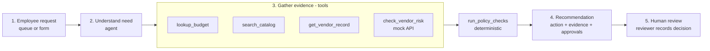
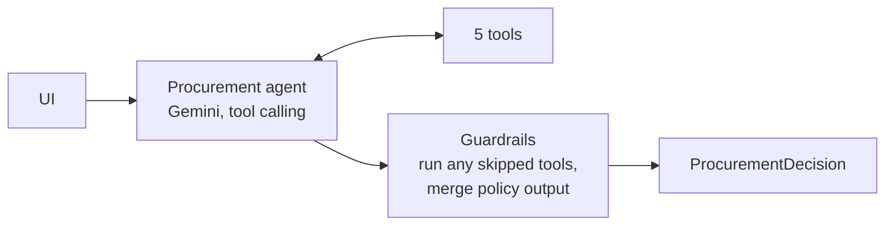
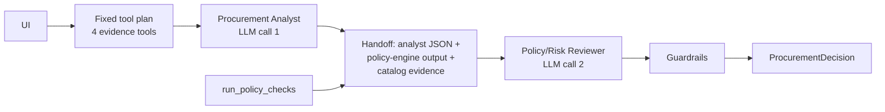

# Architecture and workflow

## Product workflow



Plain-text version:

```text
Request ──> Understand need (LLM) ──> Gather evidence (4 tools) ──> Policy engine (code)
                                                                        │
          Human reviewer <── Structured decision <── Guardrails (code) ─┘
```

## Who decides what

| Concern | Owner | Where |
|---|---|---|
| Required fields / missing information (§1) | Code | `src/policy.py:find_missing_information` |
| Budget comparison (§2) | Code | `src/tools.py:lookup_budget` |
| Finding similar catalog tools (§3) | Code | `src/tools.py:search_catalog` |
| Whether an existing tool already covers the need (§3) | **LLM** (heuristic offline) | agent judgement → `src/decision.py` |
| Approval thresholds (§4) | Code | `src/policy.py:financial_approvals` |
| Security / Privacy / Legal triggers (§5-7) | Code | `src/policy.py:run_policy_checks` |
| 365-day review validity, registry vs API conflicts | Code, using the policy reference date | `src/policy.py:assess_vendor_security` |
| Prompt-injection scan of request and vendor text (§9) | Code + prompt rules | `src/policy.py:scan_untrusted_text` |
| Tool failure handling (§10) | Code | `src/tools.py:check_vendor_risk` |
| Need summary and rationale wording | **LLM** (template offline) | agents |
| Final approval, purchase, exceptions (§11) | **Human** | UI review panel |

The model can change the overlap judgement and the explanation. It cannot remove an approval,
a risk flag or a missing-information item, and `human_review_required` is always `true`.

## Tools

All tools are scoped to the request under review and take no free-form arguments, so text in a
request cannot point a tool at a different vendor or record.

| Tool | Type | Data | Output |
|---|---|---|---|
| `lookup_budget` | deterministic | `employees.csv`, `department_budgets.csv` | requester, department, `within` / `insufficient` / `unverified` / `unknown_cost` |
| `search_catalog` | deterministic | `software_catalog.csv`, `purchase_history.csv` | same-category products (with scope coverage), same-vendor products, prior purchases |
| `get_vendor_record` | deterministic | `vendors.csv` | registry procurement / security / legal status |
| `check_vendor_risk` | external API | `GET /vendor-risk/{vendor}` | risk profile, or a recorded failure (404, 503, unreachable) |
| `run_policy_checks` | deterministic | outputs above + `procurement_policy.md` | approvals, risk flags, missing info, cited policy findings |

Every tool returns evidence items (`source`, `finding`, `reference`) built from the data it read,
for example `software_catalog.csv:SW003` or `Policy §5`. The final evidence list only contains
these items plus the overlap judgement, so nothing in the evidence panel is model-written fact.

## Architecture A - single agent



One agent receives the request (inside `<request>` tags) and the policy text, chooses which tools
to call, and finishes with a JSON judgement: `need_summary`, `overlap_assessment`,
`overlap_reason`, `rationale`. After the loop, code runs any tool the agent skipped and builds the
decision. Max 8 turns.

## Architecture B - staged analyst → reviewer



Evidence is gathered in a fixed order by code. The analyst gets the request plus an evidence
pack and returns `need_summary`, `overlap_assessment`, `overlap_reason`, `key_evidence`,
`open_questions`. The reviewer gets the analyst JSON and the policy-engine result and returns the
same judgement format as A. Always exactly two LLM calls.

## Next-action selection (code)

Checked in this order, first match wins:

1. `request_clarification` - any required field is missing
2. `use_existing_tool` - overlap judged `existing_tool_sufficient` and the existing tool covers the requester's department
3. `verify_vendor_evidence` - vendor-risk data unavailable or conflicting with the registry
4. `route_for_review` - Security / Privacy / Legal review required, or budget insufficient / unverified
5. `standard_approval` - only the financial-threshold approvers are needed

## Guardrails and stop conditions

- Model output with embedded instructions or approval claims ("CFO-approved", "has been approved")
  is discarded and replaced with a deterministic rationale.
- The model cannot invent overlap: with no same-category catalog match the judgement is forced to `none`.
- Model or network failure (quota, timeout, bad JSON) → that stage falls back to the offline
  heuristic; `telemetry.mode = llm_fallback`.
- Vendor-risk API failure is never treated as a pass: `vendor_risk_unavailable`, Security review,
  Privacy as a precaution when the data is sensitive, and the action becomes `verify_vendor_evidence`.
- The agent loop stops after 8 turns.

## Assumptions

- Reference date is read from `data/procurement_policy.md` (2026-09-30), not from the system clock.
  A review dated exactly 365 days before it is still current.
- `requested_integrations: []` means "no integrations" and is complete; `null` is missing.
- `data_access_level` of `unknown`, `tbd` or empty is missing information. `none` is a valid answer.
- Sensitive data for Security: anything containing `source_code`, `confidential`, `pii`, `personal`,
  `credential`, `secret` or `production`. Privacy: `pii` / `personal`.
- Integrations touching production, cloud accounts, git repositories, databases or credentials need Security.
- "New vendor" means not in the registry or registry procurement status other than `Approved`.
- Legal terms other than `Approved` (e.g. `Draft`, `Unknown`) need Legal review.
- Cross-region storage + sensitive data triggers both Privacy (§6) and Legal (§7).
- If the vendor-risk service is unavailable and the data is sensitive, residency cannot be confirmed,
  so Privacy review is added as a precaution.
- Overlap is checked by catalog category. Same-vendor products in a different category are shown as
  context but not flagged as overlap.
- A requester whose department has no budget row is routed to Finance (`budget_unverified`).
- An unknown requester is missing information; the request cannot be routed.
- Urgency does not relax any control.
- Request IDs are never used in logic; the same code handles ad-hoc requests from the UI form.

## What was intentionally not built

- No persistence or auth for the human review log (session-only in the UI).
- No vector store / RAG; the policy is short enough to pass in full.
- No agent framework; the loop is ~40 lines with the OpenAI-compatible SDK.
- No more than two agents.
